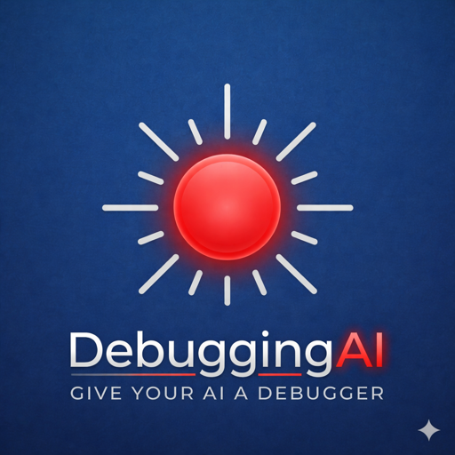

# DebuggingAI



> Universal debugger control for any AI agent.

DebuggingAI is a VS Code extension that exposes debugger control as a tool interface — so any AI agent (Claude Code, Cline, Cursor, Copilot Workspace, local LLMs) can set breakpoints, inspect state, and drive a debug session without knowing VS Code internals.

## Positioning

Most AI coding agents can read and write files. None can control the debugger.
DebuggingAI bridges that gap — agent-agnostic, runtime-agnostic, built on VS Code's native debug API and the Debug Adapter Protocol.

```
Agent (Claude / Cline / any)
        ↓
  DebuggingAI extension   ←  also accepts manual gutter clicks
        ↓  DAP
  debugpy / node / delve / dart …
        ↓
  Your running program
```

## Clients

### MCP server (Claude Desktop, Cline, any MCP-capable agent)

The MCP server wraps every HTTP command as a typed MCP tool. No curl, no JSON wrangling — the agent sees named tools with descriptions and calls them directly.

**1. Build**

```bash
npm install
npm run compile
```

**2. Register the MCP server**

**Claude Code (CLI)**

```bash
# local Node.js (stdio transport — default when using --)
claude mcp add debuggingai -- node /absolute/path/to/DebuggingAI/out/clients/mcp/index.js

# Docker (no local Node.js required)
claude mcp add debuggingai -- docker run --rm -i \
  -e DEBUGAI_HOST=host.docker.internal \
  pitronot/debuggingai:latest node out/clients/mcp/index.js

# With custom port
claude mcp add --env DEBUGAI_PORT=9000 debuggingai -- node /absolute/path/to/DebuggingAI/out/clients/mcp/index.js
```

**Claude Desktop / Cline / Cursor — `claude_desktop_config.json`**

The config file is at:
- macOS: `~/Library/Application Support/Claude/claude_desktop_config.json`
- Windows: `%APPDATA%\Claude\claude_desktop_config.json`

**Option A — local Node.js** (server running in VS Code or standalone):

```json
{
  "mcpServers": {
    "debuggingai": {
      "command": "node",
      "args": ["/absolute/path/to/DebuggingAI/out/clients/mcp/index.js"]
    }
  }
}
```

**Option B — Docker** (no local Node.js required):

```json
{
  "mcpServers": {
    "debuggingai": {
      "command": "docker",
      "args": [
        "run", "--rm", "-i",
        "-e", "DEBUGAI_HOST=host.docker.internal",
        "pitronot/debuggingai:latest",
        "node", "out/clients/mcp/index.js"
      ]
    }
  }
}
```

> **Note:** `host.docker.internal` lets the container reach the DebuggingAI server running on your host machine (macOS/Windows). On Linux, use `--network host` and omit `DEBUGAI_HOST`.

**3. Start the DebuggingAI server**

The VS Code extension auto-starts the server when it activates. Or start it manually:

```bash
node out/bin/server.js          # default port 7890
DEBUGAI_PORT=9000 node out/bin/server.js
```

The MCP server connects to `localhost:7890` by default. Override with `DEBUGAI_PORT`:

```bash
DEBUGAI_PORT=9000 node out/clients/mcp/index.js
```

**Available MCP tools**

| Tool | What it does |
|---|---|
| `set_breakpoint` | Set a breakpoint at file:line, optional condition |
| `list_breakpoints` | List all breakpoints |
| `clear_breakpoint` | Remove a breakpoint by ID |
| `clear_all_breakpoints` | Remove all breakpoints |
| `start_session` | Start a debug session by launch.json config name |
| `stop_session` | Stop the active session |
| `restart_session` | Restart the active session |
| `session_status` | Get current status (idle / running / paused) |
| `continue` | Resume until next breakpoint |
| `next` | Step over |
| `step` | Step into |
| `step_out` | Step out |
| `run_until` | Run until a specific line |
| `jump_to` | Jump execution to a line |
| `print` | Evaluate and print an expression |
| `whatis` | Show the type of an expression |
| `exec` | Execute a statement in the current frame |
| `watch` | Register an expression to watch |
| `unwatch` | Remove a watched expression |
| `show_args` | Show current frame arguments |
| `show_return_value` | Show last return value |

### Docker (headless server, no VS Code)

Run the standalone HTTP + WebSocket server in a container. Useful when the debugger and AI agent run on different machines or in CI.

```bash
docker run -p 7890:7890 pitronot/debuggingai:latest
```

The server listens on `0.0.0.0:7890` inside the container. Connect a debug client (VS Code extension or MCP server) to `http://host-ip:7890`.

### HTTP API (curl / any HTTP client)

All commands use a single endpoint: `POST /` with a JSON body containing `command` and any required parameters.

```bash
# List breakpoints
curl -X POST http://localhost:7890/ \
  -H 'Content-Type: application/json' \
  -d '{"command":"list"}'

# Set a breakpoint
curl -X POST http://localhost:7890/ \
  -H 'Content-Type: application/json' \
  -d '{"command":"set","file":"/path/to/app.py","line":42}'

# Start a debug session
curl -X POST http://localhost:7890/ \
  -H 'Content-Type: application/json' \
  -d '{"command":"start","config":"Debug App"}'

# Print an expression
curl -X POST http://localhost:7890/ \
  -H 'Content-Type: application/json' \
  -d '{"command":"print","expression":"my_var"}'
```

## Feature set

### Breakpoints
| Command | What it does |
|---|---|
| `set` | Set breakpoint at file:line, optional condition |
| `edit` | Change condition or enabled state |
| `list` | List all breakpoints as JSON |
| `clear` | Remove one breakpoint by ID |
| `clearAll` | Remove all breakpoints |

### Session lifecycle
| Command | What it does |
|---|---|
| `start` | Launch a `launch.json` config by name |
| `quit` | Stop the active session |
| `restart` | Restart the active session |
| `status` | Active session info |

### Execution control
| Command | What it does |
|---|---|
| `continue` | Resume until next breakpoint |
| `next` | Step over |
| `step` | Step into |
| `return` | Step out |
| `until` | Run until line |
| `jump` | Jump to line |

### Inspection
| Command | What it does |
|---|---|
| `print` | Evaluate and print |
| `prettyPrint` | Pretty-print |
| `whatis` | Type of expression |
| `display` | Watch an expression |
| `undisplay` | Remove watch |
| `args` | Current frame args |
| `retval` | Last return value |

## Roadmap

| Sprint | Feature |
|---|---|
| ✅ 1 | Breakpoint management |
| ✅ 2 | Session lifecycle |
| ✅ 3 | Execution control |
| ✅ 4 | Inspection — print, pp, whatis, display, args, retval |
| ✅ — | MCP server — all commands as typed MCP tools |
| ✅ — | Docker image — headless server, no VS Code required |
| 5 | Shared debug session bus — multi-client pub/sub, session replay |
| 6 | Stack navigation — backtrace, up, down |

## Works with

Claude Desktop · Claude Code · Cline · Cursor · GitHub Copilot Workspace · any MCP-capable agent · any agent that can make HTTP requests.

## Development

```bash
npm install
npm run compile   # TypeScript → out/  (extension + server + MCP client)
npm test          # Jest unit tests (no VS Code required)
npm run test:vscode  # VS Code integration tests
```

Press `F5` in VS Code to launch the Extension Development Host.
